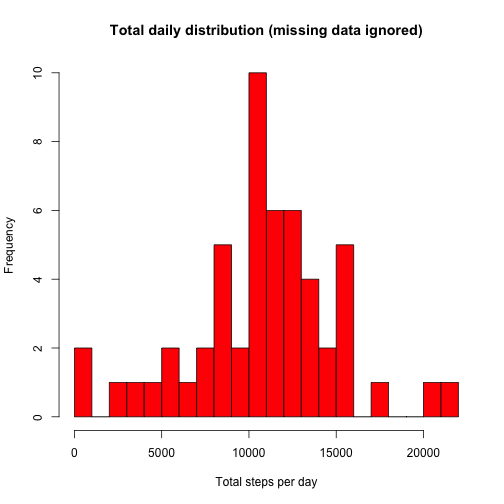
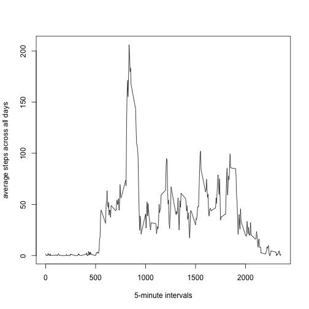
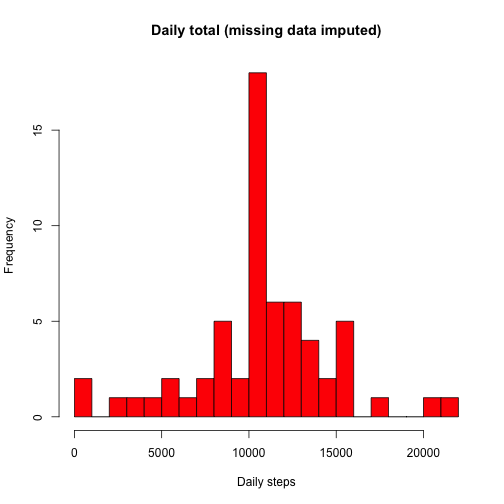

# Reproducible Research (project 1)
This assignment makes use of data from a personal activity monitoring device. This device collects data at 5 minute intervals through out the day. The data consists of two months of data from an anonymous individual collected during the months of October and November, 2012 and include the number of steps taken in 5 minute intervals each day.  

## The data
The data file can be downloaded from [Activity Monitoring\ Dtata](https://d396qusza40orc.cloudfront.net/repdata%2Fdata%2Factivity.zip). The size is 52KB.  


```r
knitr::opts_chunk$set(echo = TRUE)
```
  
Download file and unzip it into your current working directory    

```r
zipurl <- "https://d396qusza40orc.cloudfront.net/repdata%2Fdata%2Factivity.zip"
#replace my working directory with yours
zipdest <- "/Users/Michael/Documents/Data Science/Reproducible Research/week2/project/activity.zip"
download.file(zipurl,destfile = zipdest,mode = "wb")
unzip("activity.zip",exdir = "./")
# packages needed for analysis
library(ggplot2)
library(plyr)
```

Read data in and prepare the data for later analysis    

```r
activity <- read.csv("activity.csv")
#convert date column from factor to date
activity$date <- as.Date(activity$date)
# remove NAs from 'steps' data and subset 'activity' in a separate data set
cleanData <- subset(activity, !is.na(activity$steps))
```

## What is mean total number of steps taken per day?  
This step will produce a histogram showing distribution of total number of steps taken daily.  
This step uses data without NA values.

```r
stepsperday <- tapply(cleanData$steps, cleanData$date, sum, na.rm=TRUE, simplify = TRUE)
stepsperday <- stepsperday[!is.na(stepsperday)]
hist(x=stepsperday,col = "red", breaks = 20, xlab = "Total steps per day",
     ylab = "Frequency", main = "Total daily distribution (missing data ignored)")
```



### What is the mean and the median of daily steps taken?  

```r
mean(stepsperday)
```

```
## [1] 10766.19
```

```r
median(stepsperday)
```

```
## [1] 10765
```

### mean = 10766.19, median = 10765 .

### What is the average daily activity pattern?  
To answer this question, we create a plot of the 5-minute interval (x-axis) and the average number of steps taken, averaged across all days (y-axis).  

```r
# calculate mean of steps taken per each interval
intervalAvg <- tapply(cleanData$steps, cleanData$interval, mean, na.rm=TRUE, simplify=TRUE)
df_ia <- data.frame(interval=as.integer(names(intervalAvg)), avg=intervalAvg)
with(df_ia, plot(interval, avg, type="l", xlab="5-minute intervals",
          ylab="average steps across all days"))
```



```r
#calculate which interval has maximum number of steps
max_steps <- max(df_ia$avg)
df_ia[df_ia$avg == max_steps, ]
```

```
##     interval      avg
## 835      835 206.1698
```

### the interval 835 has max number of steps (206).  

## Imputing missing values  
How many rows with missing values in the original data set?  

```r
sum(is.na(activity$steps))
```

```
## [1] 2304
```

There are 2304 rows with missing data.  
In any 5 min. interval with missing value, we will replace the missing value with mean value   
of that interval.  A new data set will be create from the original with missing data replaced.  

```r
impute <- activity
NAx <- is.na(impute$steps)
int_avg <- tapply(cleanData$steps, cleanData$interval, mean, na.rm=TRUE, simplify=TRUE)
impute$steps[NAx] <- int_avg[as.character(impute$interval[NAx])]
```

Now we generate histogram showing total of daily steps with missing data imputed.  

```r
newSum <- tapply(impute$steps, impute$date, sum, na.rm=TRUE, simplify = TRUE)
hist(x=newSum, col = "red", breaks = 20, xlab = "Daily steps", ylab = "Frequency", 
     main = "Daily total (missing data imputed)")
```



```r
# calculate mean and median of total number of steps taken daily
mean(newSum)
```

```
## [1] 10766.19
```

```r
median(newSum)
```

```
## [1] 10766.19
```

After the data being imputed, the mean value (10766.19) has not changed. The median value has been affected: new = 10766.19, old = 10765.  The new median value is equal to the mean, possibly because mean values were used for imputing.  Imputing data impacted frequency counts.  They are higher and closer to the mean (see histogram above).  

## Are there differences in activity patterns between weekdays and weekends?  
First, in the dataset with imputed data, we create a new factor variable with 2 levels: "weekday", "weekend".  

```r
# function to distinguish between weekdays and weekends
weekdayfun <- function(data){
  wd <- weekdays(data)
  ifelse(wd == "Saturday" | wd == "Sunday", "weekend", "weekday")
}
wk <- sapply(impute$date, weekdayfun)
impute$wk <- as.factor(wk)
#head(impute)
sum(impute$wk == "weekend")
```

```
## [1] 4608
```

The panel plot below shows number of steps taken averaged over 5 minute intervals.  The plot displays weekdays and weekends data separately.  

```r
wkData <- aggregate(steps ~ wk+interval, data = impute, FUN = mean)
library(lattice)
xyplot(steps ~ interval | factor(wk), layout = c(1,2), xlab = "Interval", 
       ylab = "Number of steps", type = "l", lty = 1, data = wkData )
```


From the plot above we can determine that activities on weekdays start earlier that on weekends.
And activities throughout a weekends are higher versus weekdays activities are lower towards the end of a day.


